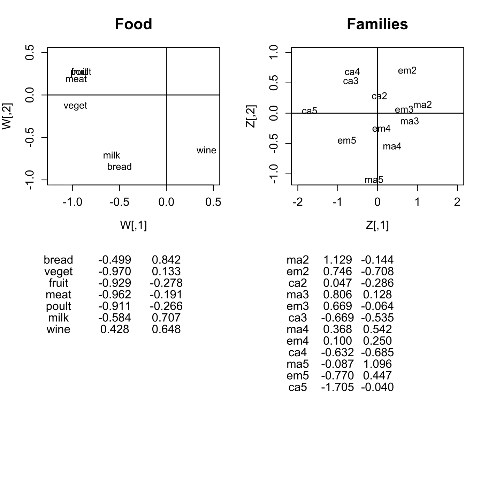
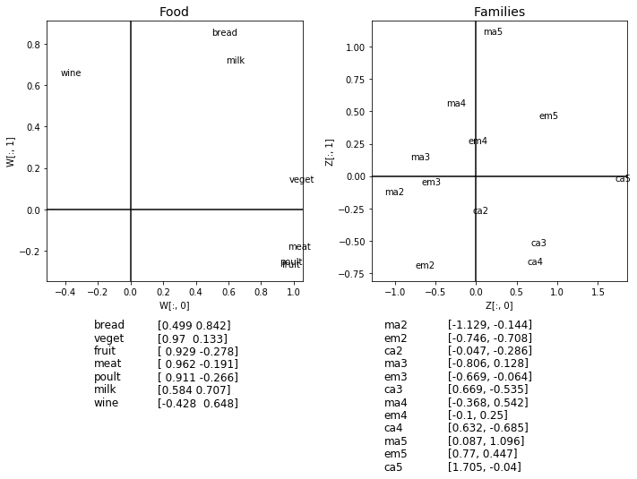
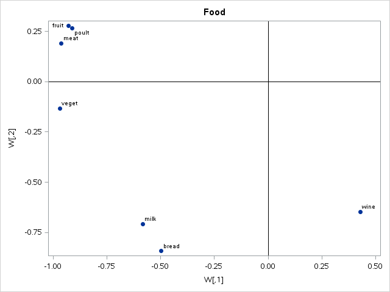
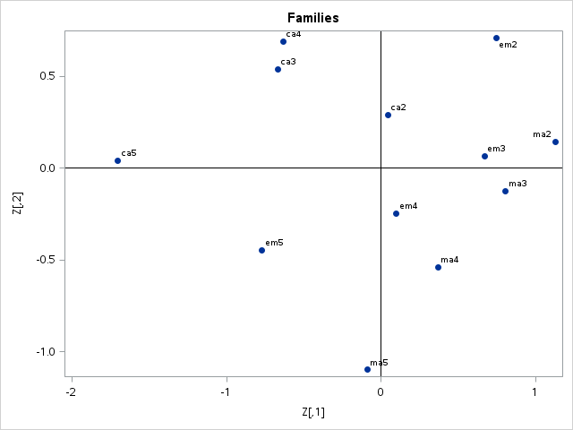

[](http://quantlet.de/)

## [](http://quantlet.de/) **MVAdecofood** [](http://quantlet.de/)

```yaml

Name of QuantLet: MVAdecofood

Published in: Applied Multivariate Statistical Analysis

Description: Computes a spectral decomposition of the French food data and gives a representation of food expenditures and family types in two dimensions.

Keywords: decomposition, eigenvalues, eigenvectors, spectral, spectral-decomposition, standardization, plot, graphical representation

Author: Zografia Anastasiadou
Author[SAS]: Svetlana Bykovskaya
Author[Python]: 'Matthias Fengler, Liudmila Gorkun-Voevoda'

Submitted: Fri, April 11 2014 by Awdesch Melzer
Submitted[SAS]: Wen, April 6 2016 by Svetlana Bykovskaya
Submitted[Python]: 'Wed, January 6 2021 by Liudmila Gorkun-Voevoda'

Datafiles: food.dat


```









### R Code
```r


# clear variables and close windows
rm(list = ls(all = TRUE))
graphics.off()

# load data
x = read.table("food.dat")
x = x[, 2:ncol(x)]
n = nrow(x)
p = ncol(x)

one = matrix(1, n, n)
h = diag(1, n, n) - one/n  # centering the matrix
a = x - matrix(apply(x, 2, mean), n, p, byrow = T)  # substracts mean
d = diag(1/sqrt(colSums(a^2)/n))

xs = h %*% as.matrix(x) %*% d  # standardized data
xs1 = xs/sqrt(n)
xs2 = t(xs1) %*% xs1

eig = eigen(xs2)  # spectral decomposition
lambda = eig$values
gamma = eig$vectors

w = gamma * (matrix(sqrt(lambda), nrow = nrow(gamma), ncol = ncol(gamma), byrow = T))  # coordinates of food
w = w[, 1:2]
w = round(w, 3)

z1 = xs1 %*% gamma  # coordinates of families
z2 = sqrt(n/p) * z1
z = z2[, 1:2]
z = round(z, 3)

namew = c("bread", "veget", "fruit", "meat", "poult", "milk", "wine")
namez = c("ma2", "em2", "ca2", "ma3", "em3", "ca3", "ma4", "em4", "ca4", "ma5", "em5", 
    "ca5")

par(mfrow = c(2, 2))
plot(w[, 1], -w[, 2], type = "n", xlab = "W[,1]", ylab = "W[,2]", main = "Food", cex.axis = 1.2, 
    cex.lab = 1.2, cex.main = 1.6, xlim = c(-1.2, 0.5), ylim = c(-1, 0.5))
text(w[, 1], -w[, 2], namew, xpd = NA)
abline(h = 0, v = 0, lwd = 1.2)

for (i in 1:7) {
    mtext(namew[i], side = 1, line = 5 + i, at = -1.15)
    mtext(toString(c(sprintf("%.3f", w[i, 1]))), side = 1, line = 5 + i, at = -0.55)
    mtext(toString(c(sprintf("%.3f", w[i, 2]))), side = 1, line = 5 + i, at = 0)
}

plot(z[, 1], -z[, 2], type = "n", xlim = c(-2, 2), ylim = c(-1.1, 1), xlab = "Z[,1]", 
    ylab = "Z[,2]", main = "Families", cex.axis = 1.2, cex.lab = 1.2, cex.main = 1.6)
text(z[, 1], -z[, 2], namez, xpd = NA)
abline(h = 0, v = 0, lwd = 1.2)

for (i in 1:12) {
    mtext(namez[i], side = 1, line = 5 + i, at = -2)
    mtext(toString(c(sprintf("%.3f", z[i, 1]))), side = 1, line = 5 + i, at = -1)
    mtext(toString(c(sprintf("%.3f", z[i, 2]))), side = 1, line = 5 + i, at = -0)
}
```

automatically created on 2021-01-08

### PYTHON Code
```python

import pandas as pd
import numpy as np
import matplotlib.pyplot as plt

x = pd.read_csv("food.dat", sep = "\s+", header=None)

x = x.iloc[:, 1:len(x.columns)]
one = np.full((len(x), len(x)), 1)
h = np.diag([1]*len(x)) - one/len(x)
a = x - np.tile(np.array(x.mean()), (len(x), 1))
d = np.diag(1/np.sqrt(np.sum(a**2)/len(x)))

xs = h @ x @ d
xs1 = xs/np.sqrt(len(x))
xs2 = xs1.T @ xs1

Lambda, gamma = np.linalg.eig(xs2)
w = gamma * np.tile(np.sqrt(Lambda), (len(gamma), 1))
w = np.round(w[:, :2], 3)

z1 = xs1 @ gamma
z2 = np.sqrt(len(x)/len(x.columns)) * z1
z = np.round(z2.iloc[:, :2], 3)

namew = ["bread", "veget", "fruit", "meat", "poult", "milk", "wine"]
namez = ["ma2", "em2", "ca2", "ma3", "em3", "ca3", "ma4", "em4", "ca4", "ma5", "em5", 
         "ca5"]

fig, axes = plt.subplots(1, 2, figsize = (10, 5))

axes[0].scatter(w[:, 0], w[:, 1], c = "w")
for i in range(0, len(namew)):
    axes[0].text(w[i, 0], w[i, 1], namew[i])

axes[0].set_xlabel("W[:, 0]")
axes[0].set_ylabel("W[:, 1]")
axes[0].axvline(0, c = "k")
axes[0].axhline(0, c = "k")
axes[0].set_title("Food", fontsize = 14)
for i in range(0, len(namew)):
    fig.text(0.15, -0.03-(0.04*i), namew[i], fontsize = 12)
    fig.text(0.25, -0.03-(0.04*i), w[i], fontsize = 12)
    
axes[1].scatter(z.iloc[:, 0], z.iloc[:, 1], c = "w")
for i in range(0, len(namez)):
    axes[1].text(z.iloc[i, 0], z.iloc[i, 1], namez[i])

axes[1].set_xlabel("Z[:, 0]")
axes[1].set_ylabel("Z[:, 1]")
axes[1].axvline(0, c = "k")
axes[1].axhline(0, c = "k")
axes[1].set_title("Families", fontsize = 14)
for i in range(0, len(namez)):
    fig.text(0.6, -0.03-(0.04*i), namez[i], fontsize = 12)
    fig.text(0.7, -0.03-(0.04*i), [z.iloc[i, 0], z.iloc[i, 1]], fontsize = 12)

plt.tight_layout()
plt.show()


```

automatically created on 2021-01-08

### SAS Code
```sas


* Import the data;
data food;
  infile '/folders/myfolders/data/food.dat';
  input temp1 $ temp2-temp8;
run;

proc iml;
  * Read data into a matrix;
  use food;
    read all var _ALL_ into x; 
  close food;

  n = nrow(x);
  p = ncol(x);
  
  one = j(n, n, 1);
  h   = i(n) - one/n;
  a   = x - repeat(x(|:,|), n, 1);
  d   = diag(1 / sqrt(a[##,] / n));
  
  xs  = h * x * d;  * standardized data;
  xs1 = xs / sqrt(n);
  xs2 = xs1` * xs1;
  
  * spectral decomposition;
  lambda = eigval(xs2);
  gamma  = eigvec(xs2);
  
  * coordinates of food;
  w = gamma # repeat(sqrt(lambda)`, nrow(gamma), 1);
  w = w[, 1:2];
  
  * coordinates of families;
  z1 = xs1 * gamma;
  z2 = sqrt(n/p) * z1;
  z  = z2[, 1:2];
  
  namew = {"bread", "veget", "fruit", "meat", "poult", "milk", "wine"};
  namez = {"ma2", "em2", "ca2", "ma3", "em3", "ca3", "ma4", "em4", "ca4", "ma5", "em5", "ca5"};

  x1  = w[,1];
  x2  = w[,2]; 
  x3  = z[,1];
  x4  = z[,2]; 
      
  create plot var {"x1" "x2" "x3" "x4" "namew" "namez"};
    append;
  close plot;
quit;

proc sgplot data = plot
    noautolegend;
  title 'Food';
  scatter x = x1 y = x2 / markerattrs = (symbol = circlefilled)
    datalabel = namew;
  refline 0 / lineattrs = (color = black);
  refline 0 / axis = x lineattrs = (color = black);
  xaxis label = 'W[,1]';
  yaxis label = 'W[,2]';
run;

proc print data = plot(obs = 7) noobs label;
  var namew x1 x2;
  label namew='names' x1='W[,1]' x2 = 'W[,2]';
run;


proc sgplot data = plot
    noautolegend;
  title 'Families';
  scatter x = x3 y = x4 / markerattrs = (symbol = circlefilled)
    datalabel = namez;
  refline 0 / lineattrs = (color = black);
  refline 0 / axis = x lineattrs = (color = black);
  xaxis label = 'Z[,1]';
  yaxis label = 'Z[,2]';
run;

proc print data = plot noobs label;
  var namez x3 x4;
  label namez='names' x1='W[,1]' x2 = 'W[,2]';
run;


```

automatically created on 2021-01-08