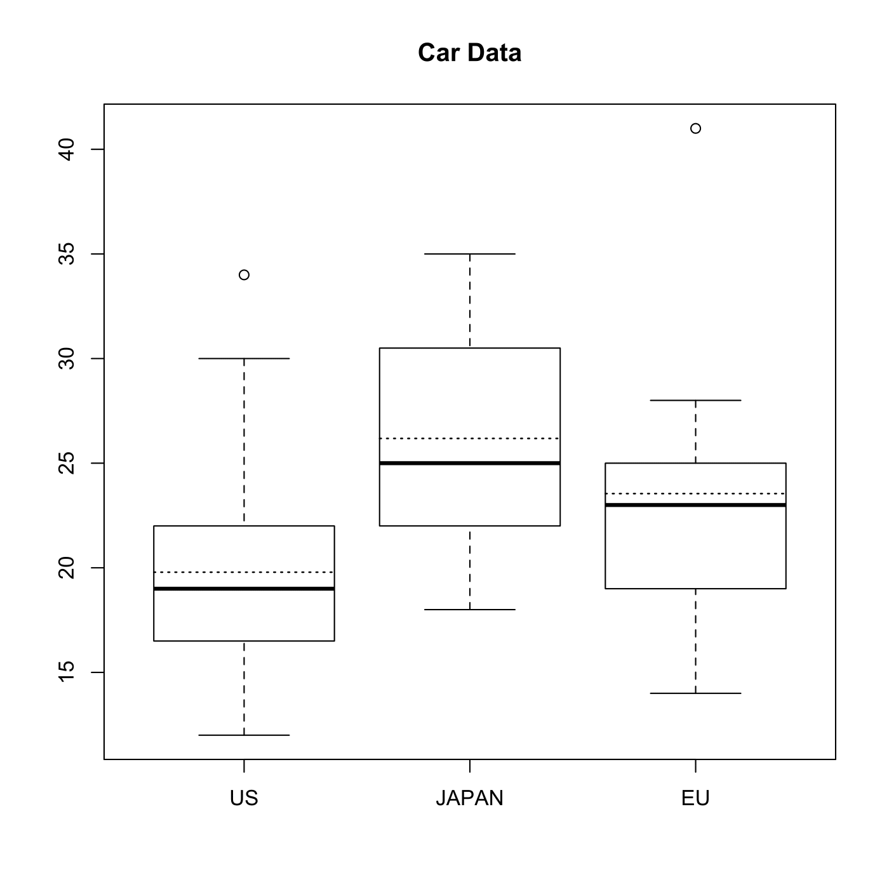
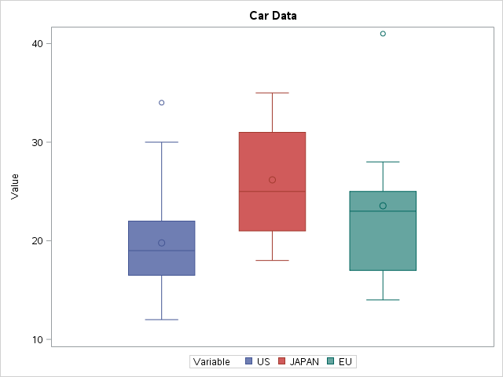

[](http://quantlet.de/)

## [](http://quantlet.de/) **MVAboxcar** [](http://quantlet.de/)

```yaml

Name of QuantLet : MVAboxcar

Published in : Applied Multivariate Statistical Analysis

Description : 'Computes the five-number summary and boxplots for the mileage (X14 variable) of US,
Japanese and European cars.'

Keywords : 'descriptive, descriptive-statistics, quantile, five number summary, financial, data
visualization, boxplot, plot, graphical representation, sas'

See also : MVAboxbank1, MVAboxbank6, MVAboxbhd, MVAboxcity

Author : Vladimir Georgescu, Song Song, Jorge Patron

Author[SAS] : Svetlana Bykovskaya

Submitted : Tue, September 09 2014 by Awdesch Melzer

Submitted[SAS] : Wen, April 6 2016 by Svetlana Bykovskaya

Datafiles : carc.txt, carc_sas.txt

```






### R Code:
```r

# clear variables and close windows
rm(list = ls(all = TRUE))
graphics.off()

# load data
x = read.table("carc.txt")

# parameter settings
k      = 0
l      = 0
m      = 0
us     = NULL
japan  = NULL
europe = NULL
M      = x[, 2]
C      = x[, 13]

for (i in 1:dim(x)[1]) {
    if (x[i, 13] == 1) {
        k = k + 1
        us[k] = x[i, 2]
    } else if (x[i, 13] == 2) {
        l = l + 1
        japan[l] = x[i, 2]
    } else if (x[i, 13] == 3) {
        m = m + 1
        europe[m] = x[i, 2]
    }
}

m1 = mean(us)
m2 = mean(japan)
m3 = mean(europe)

# plot
boxplot(us, japan, europe, axes = FALSE, frame = TRUE)
axis(side = 1, at = seq(1, 3), label = c("US", "JAPAN", "EU"))
axis(side = 2, at = seq(0, 50, 5), label = seq(0, 50, 5))
title("Car Data")
lines(c(0.6, 1.4), c(m1, m1), lty = "dotted", lwd = 1.2)
lines(c(1.6, 2.4), c(m2, m2), lty = "dotted", lwd = 1.2)
lines(c(2.6, 3.4), c(m3, m3), lty = "dotted", lwd = 1.2)

(five = quantile(x[, 2], c(0.025, 0.25, 0.5, 0.75, 0.975)))
```

### SAS Code:
```sas

* Import the data;
data carc;
  infile '/folders/myfolders/Sas-work/data/carc_sas.txt';
  input t1 $ t2 $ t3 $ t4 $ t5 $ t6 $ t7 $ t8 $ t9 $ t10 $ t11 $ t12 $ t13 $;
  M = input(t2, 8.);
  C = input(t13, 8.);
  drop t1--t13;
run;

data obs1;
  set carc;
  if C = 1;
  US = M;
  drop M C;
run;

data obs2;
  set carc;
  if C = 2;
  JAPAN = M;
  drop M C;
run;

data obs3;
  set carc;
  if C = 3;
  EU = M;
  drop M C;
run;

data carc;
  id + 1;
  merge obs1 obs2 obs3;
run;

proc transpose data = carc out = car_t;
  by id;
run;

data car_t;
  set car_t;
  label _name_ = "Variable";
  label col1 = "Value";
run;

title "Car Data";
proc sgplot data = car_t;
  vbox col1 / group = _name_ ;
run;


```
