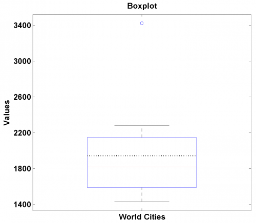
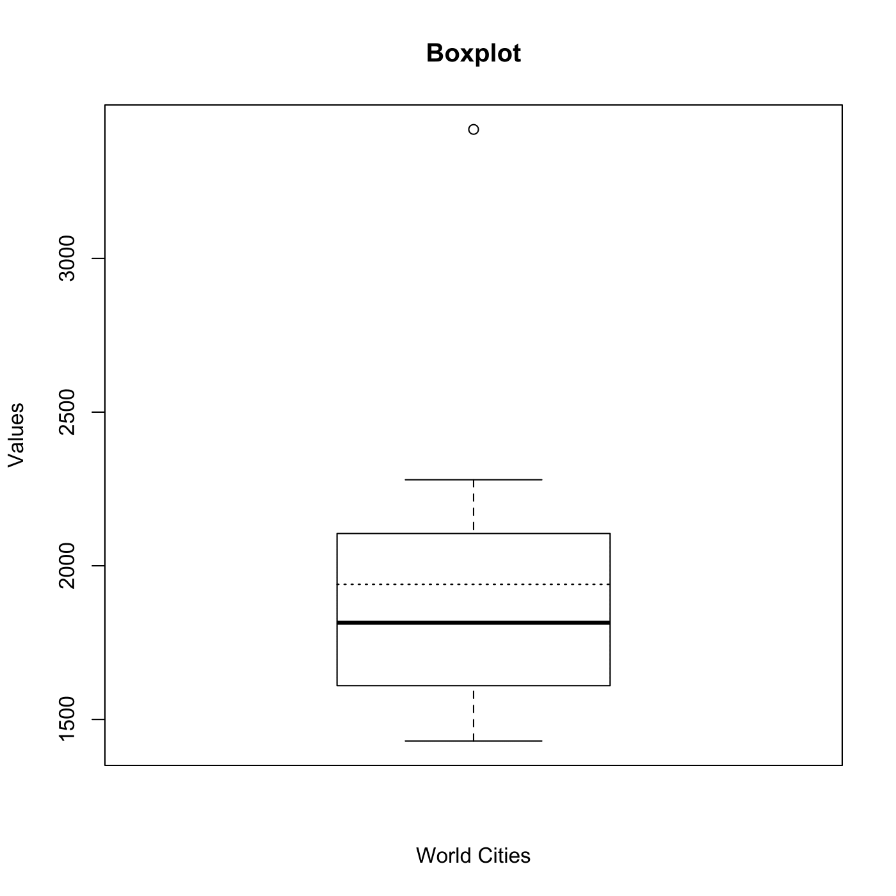
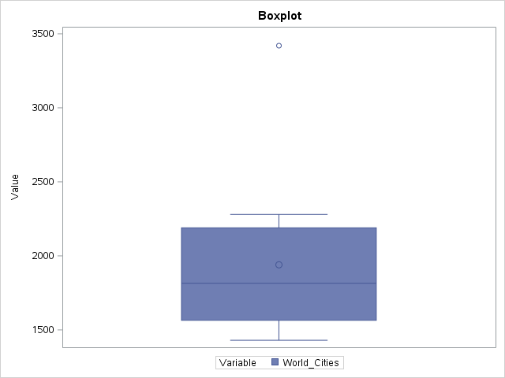

[](http://quantlet.de/)

## [](http://quantlet.de/) **MVAboxcity** [](http://quantlet.de/)

```yaml

Name of QuantLet: MVAboxcity

Published in: Applied Multivariate Statistical Analysis

Description: 'Computes the five-number summary and a boxplot for world cities.'

Keywords: descriptive, descriptive-statistics, quantile, five number summary, financial, data visualization, boxplot, plot, graphical representation, sas

See also: MVAboxbank1, MVAboxbank6, MVAboxbhd, MVAboxcar

Author: Jorge Patron, Vladimir Georgescu, Song Song
Author[SAS]: Svetlana Bykovskaya
Author[Python]: 'Matthias Fengler, Liudmila Gorkun-Voevoda'

Submitted: Tue, September 09 2014 by Awdesch Melzer
Submitted[SAS]: Wen, April 6 2016 by Svetlana Bykovskaya
Submitted[Matlab]: Mon, November 14 2016 by Lily Medina
Submitted[Python]: 'Wed, January 6 2021 by Liudmila Gorkun-Voevoda'


Datafiles: cities.txt

```








### R Code
```r


# clear variables and close windows
rm(list = ls(all = TRUE))
graphics.off()

# load data
x  = read.table("cities.txt")
m1 = mean(as.matrix(x))

# Plot box plot
boxplot(x, xlab = "World Cities", ylab = "Values")
lines(c(0.8, 1.2), c(m1, m1), col = "black", lty = "dotted", lwd = 1.2)
title("Boxplot")

# Five Number Summary R 'quantile' function uses a different algorithm to
# calculate the sample quantiles than in the MVA book Therefore, the values
# using Matlab could differ from the Book values, but the difference is not
# great, and should not be significant.  Easiest way to calculate Five Number
# Summary is quantile(population,[.025 .25 .50 .75 .975])
five = quantile(x[, 1], c(0.025, 0.25, 0.5, 0.75, 0.975))

# Display results
print("Five number summary, in millions")
print(five/100)
```

automatically created on 2021-01-08

### MATLAB Code
```matlab

%% Clear variables and close windows
close all
clear
clc

%% Load data
x  = load('cities.txt');
m1 = mean(x);

%% Plot box plot
hold on
boxplot(x,'Symbol','o','label',{'World Cities'},'widths',0.5)
line([0.75 1.25],[m1 m1],'Color','k','LineStyle',':','LineWidth',1.2)
title('Boxplot')
hold off

%% Five Number Summary%
% Matlab "quantile" function uses a different algorithm to calculate the sample quantiles than in the MVA book%
% Therefore, the values using Matlab could differ from the Book values, but
% the difference is not great, and should not be significant.
% Easiest way to calculate Five Number Summary is
% quantile(population,[.025 .25 .50 .75 .975])
five = quantile(x,[.025 .25 .50 .75 .975]);

%% Display results
disp('Five number summary, in millions')
disp('     0.025     0.25      0.5       0.75     0.975 ')
disp(five/100)
```

automatically created on 2021-01-08

### PYTHON Code
```python

import pandas as pd
import matplotlib.pyplot as plt
import numpy as np

x = pd.read_csv('cities.txt', sep=" ", header=None)
m1 = x.mean()

fig, ax = plt.subplots(figsize = (10, 10))
ax.boxplot(x[0], patch_artist=True, boxprops=dict(facecolor = "lightgrey"), 
           medianprops=dict(color="black", linewidth = 2.5), meanline = True, 
           showmeans = True, meanprops=dict(color="black"), widths = 0.3)
ax.set_xlabel("World Cities", fontsize = 15)
ax.set_ylabel("Values", fontsize = 15)
plt.title("Boxplot", fontsize = 20)

five = np.quantile(x, [0.025, 0.25, 0.5, 0.75, 0.975])
print("Five number summary, in millions")
pd.DataFrame(data = {"value": five}, index = ["2.5%", "25%", "50%", "75%", "97.5%"]).T
```

automatically created on 2021-01-08

### SAS Code
```sas


* Import the data;
data cities;
  id + 1;
  infile '/folders/myfolders/Sas-work/data/cities.txt';
  input World_Cities;
run;

proc transpose data = cities out = cities_t;
  by id;
run;

data cities_t;
  set cities_t;
  label _name_ = "Variable";
  label col1 = "Value";
run;

title "Boxplot";
proc sgplot data = cities_t;
  vbox col1 / group = _name_ ;
run;

title 'Five number summary';
proc means data = cities p5 p25 p50 p75 p95;
  var World_Cities;
run;
```

automatically created on 2021-01-08