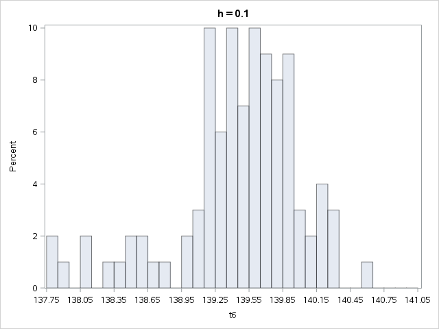
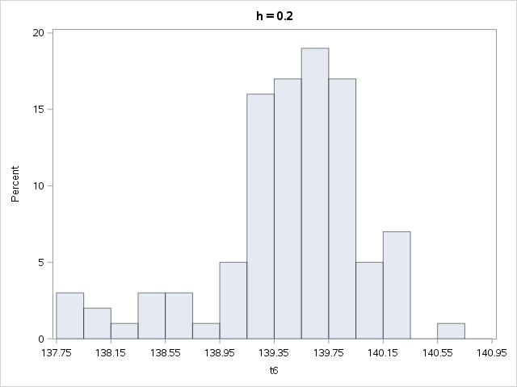
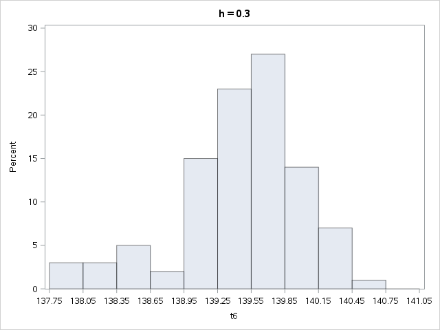

[](http://quantlet.de/)

## [](http://quantlet.de/) **MVAhisbank1** [](http://quantlet.de/)

```yaml

Name of QuantLet : MVAhisbank1

Published in : Applied Multivariate Statistical Analysis

Description : 'Computes 4 histograms for the diagonal of the forged Swiss bank notes. The
histograms are different with respect to their binwidth.'

Keywords : 'binwidth, density, descriptive, descriptive-statistics, distribution, empirical,
histogram, origin, plot, graphical representation, financial, data visualization, sas'

See also : MVAhisbank2

Author : Song Song, Vladimir Georgescu, Jorge Patron

Author[SAS] : Svetlana Bykovskaya

Submitted : Tue, September 09 2014 by Awdesch Melzer

Submitted[SAS] : Wen, April 6 2016 by Svetlana Bykovskaya

Datafiles : bank2.dat

Example : 'Diagonal of counterfeit bank notes. Histograms with x0 = 137.8 and h = 0.1 (upper left),
h = 0.2 (lower left), h = 0.3 (upper right), h = 0.4 (lower right).'

```









### R Code:
```r

# clear variables and close windows
rm(list = ls(all = TRUE))
graphics.off()

# load data
x = read.table("bank2.dat")
x = x[101:200, 6]
origin = 137.75

# Because origin<min(x), the histogram includes all values
y1 = seq(137.75, 141.05, 0.1)
y2 = seq(137.75, 141.05, 0.2)
y3 = seq(137.75, 141.05, 0.3)
y4 = seq(137.75, 141.05, 0.4)

par(mfrow = c(2, 2))

hist(x, y1, ylab = "Diagonal", xlab = "h = 0.1", xlim = c(137.5, 141), ylim = c(0, 
    10.5), main = "Swiss Bank Notes", axes = FALSE)
axis(side = 1, at = seq(138, 141), labels = seq(138, 141))
axis(side = 2, at = seq(0, 10, 2), labels = seq(0, 10, 2))

hist(x, y3, ylab = "Diagonal", xlab = "h = 0.3", xlim = c(137.5, 141), ylim = c(0, 
    31.5), main = "Swiss Bank Notes", axes = FALSE)
axis(side = 1, at = seq(138, 141), labels = seq(138, 141))
axis(side = 2, at = seq(0, 30, 5), labels = seq(0, 30, 5))

hist(x, y2, ylab = "Diagonal", xlab = "h = 0.2", xlim = c(137.5, 141), ylim = c(0, 
    21), main = "Swiss Bank Notes", axes = FALSE)
axis(side = 1, at = seq(138, 141), labels = seq(138, 141))
axis(side = 2, at = seq(0, 20, 5), labels = seq(0, 20, 5))

hist(x, y4, ylab = "Diagonal", xlab = "h = 0.4", xlim = c(137.5, 141), ylim = c(0, 
    42), main = "Swiss Bank Notes", axes = FALSE)
axis(side = 1, at = seq(138, 141), labels = seq(138, 141))
axis(side = 2, at = seq(0, 40, 10), labels = seq(0, 40, 10))
```

### SAS Code:
```sas

* Import the data;
data bank2;
  infile '/folders/myfolders/Sas-work/data/bank2.dat';
  input t1-t6;
  drop t1-t5;
run;

data b2;
  set bank2 (firstobs = 101 obs = 200);
run;

* Because origin=137.75<min(x), the histogram includes all values;
title 'Swiss Bank Notes';
proc univariate data = b2 noprint;
  histogram t6 / 
    odstitle = 'h = 0.1'
    endpoints = 137.75 to 141.05 by 0.1;
  histogram t6 / 
    odstitle = 'h = 0.2'
    endpoints = 137.75 to 141.05 by 0.2;
  histogram t6 / 
    odstitle = 'h = 0.3'
    endpoints = 137.75 to 141.05 by 0.3;
  histogram t6 / 
    odstitle = 'h = 0.4'
    endpoints = 137.75 to 141.05 by 0.4;
run;


```
