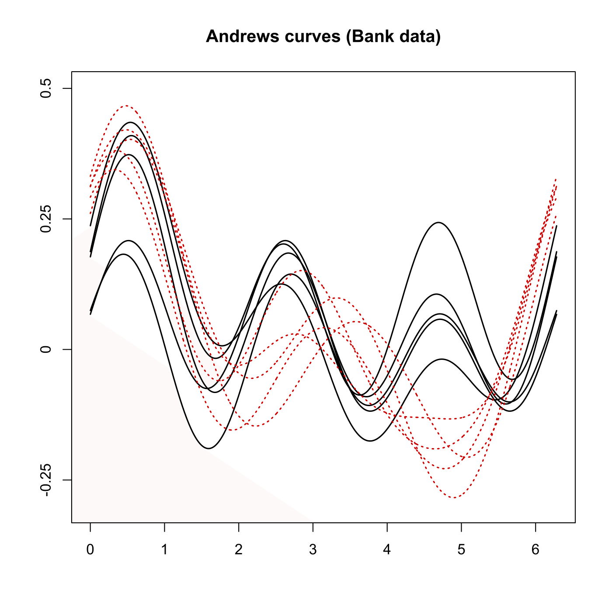

[](http://quantlet.de/)

## [](http://quantlet.de/) **MVAandcur** [](http://quantlet.de/)

```yaml

Name of QuantLet : MVAandcur

Published in : Applied Multivariate Statistical Analysis

Description : 'Computes Andrew's Curves for the observations 96-105 of the Swiss bank notes data.
The order of the variables is 1,2,3,4,5,6.'

Keywords : 'Andrews curves, descriptive methods, normalization, scaling, financial, plot, graphical
representation, data visualization'

See also : MVAandcur2, MVAparcoo1

Author : anonumous

Submitted : Tue, September 09 2014 by Awdesch Melzer

Datafiles : bank2.dat

```




### R Code:
```r

# clear variables and close windows
rm(list = ls(all = TRUE))
graphics.off()

# install and load packages
libraries = c("tourr")
lapply(libraries, function(x) if (!(x %in% installed.packages())) {
install.packages(x)
})
lapply(libraries, library, quietly = TRUE, character.only = TRUE)

# load data
data = read.table("bank2.dat")
x = data[96:105, ]
y = NULL
i = 1

while (i <= 6) {
    z = (x[, i] - min(x[, i]))/(max(x[, i]) - min(x[, i]))  # zero-one scaling
    y = cbind(y, z)
    i = i + 1
}

Type = c(rep(1, 5), rep(2, 5))
f = as.integer(Type)
grid = seq(0, 2 * pi, length = 1000)

# plot
plot(grid, andrews(y[1, ])(grid), type = "l", lwd = 1.5, main = "Andrews curves (Bank data)", 
    axes = FALSE, frame = TRUE, ylim = c(-0.3, 0.5), ylab = "", xlab = "")
for (i in 2:5) {
    lines(grid, andrews(y[i, ])(grid), col = "black", lwd = 1.5)
}
for (i in 6:10) {
    lines(grid, andrews(y[i, ])(grid), col = "red3", lwd = 1.5, lty = "dotted")
}
axis(side = 2, at = seq(-0.5, 0.5, 0.25), labels = seq(-0.5, 0.5, 0.25))
axis(side = 1, at = seq(0, 7, 1), labels = seq(0, 7, 1))
```
