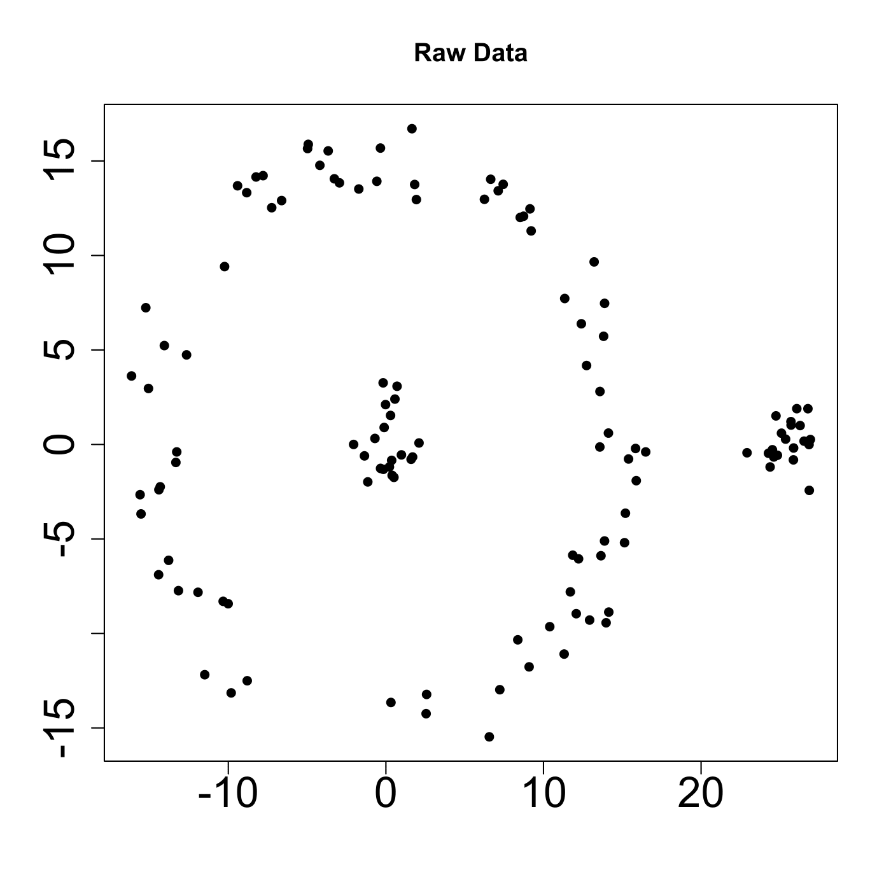
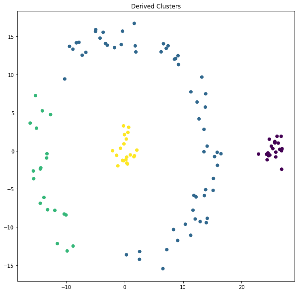

[](http://quantlet.de/)

## [](http://quantlet.de/) **MVAspecclust** [](http://quantlet.de/)

```yaml

Name of QuantLet: MVAspecclust

Published in: Applied Multivariate Statistical Analysis

Description: MVAspecclust computes the clusters for the exemplary data based on the Euclidean distance and predefined number of clusters.

Keywords: cluster-analysis, spectral, plot, graphical representation, distance, euclidean, data visualization

See also: MVAclus8p, MVAclusbank, MVAclusbh, MVAclusfood, MVAclususcrime, SMSclus8p, SMSclus8pd, SMSclus8pmst2, SMSclusbank, SMScluscomp, SMScluscrime, SMScluscrimechi2, SMSclushealth

Author: Piotr Majer
Author[Python]: Matthias Fengler, Liudmila Gorkun-Voevoda

Submitted: Sun, September 07 2014 by Awdesch Melzer
Submitted[Python]: Wed, September 9 2020 by Liudmila Gorkun-Voevoda

Datafile: data_example.dat

Example: 
- 1: Plot of raw data.
- 2: Plot of derived clusters.

```






### PYTHON Code
```python

import pandas as pd
from sklearn.cluster import SpectralClustering
import matplotlib.pyplot as plt

data = pd.read_csv("data_example.dat", sep = "\s+", header=None)
data = data.T

sc = SpectralClustering(n_clusters=4, eigen_solver="arpack", affinity = "rbf").fit(data)

fig, ax = plt.subplots(figsize = (10, 10))
ax.scatter(data[0], data[1], c = "black")
ax.set_title("Raw Data")
plt.show()

fig, ax = plt.subplots(figsize = (10, 10))
ax.scatter(data[0], data[1], c = sc.labels_)
ax.set_title("Derived Clusters")
plt.show()
```

automatically created on 2020-09-10

### R Code
```r


# clear all variables
rm(list = ls(all = TRUE))
graphics.off()

# install and load packages
libraries = c("kernlab")
lapply(libraries, function(x) if (!(x %in% installed.packages())) {
    install.packages(x)
})
lapply(libraries, library, quietly = TRUE, character.only = TRUE)

# load data
data = t(read.table("data_example.dat", quote = ""))
sc = specc(data, centers = 4)
centers(sc)
size(sc)
withinss(sc)

# plot 1: raw data
plot(data, col = "black", main = "Raw Data", xlab = "", ylab = "", cex.axis = 2, lwd = 2, pch = 16)

# plot 2: derived clusters
dev.new("")
plot(data, col = sc, main = "Derived Clusters", xlab = "", ylab = "", cex.axis = 2, lwd = 2, pch = 16) 

```

automatically created on 2020-09-10