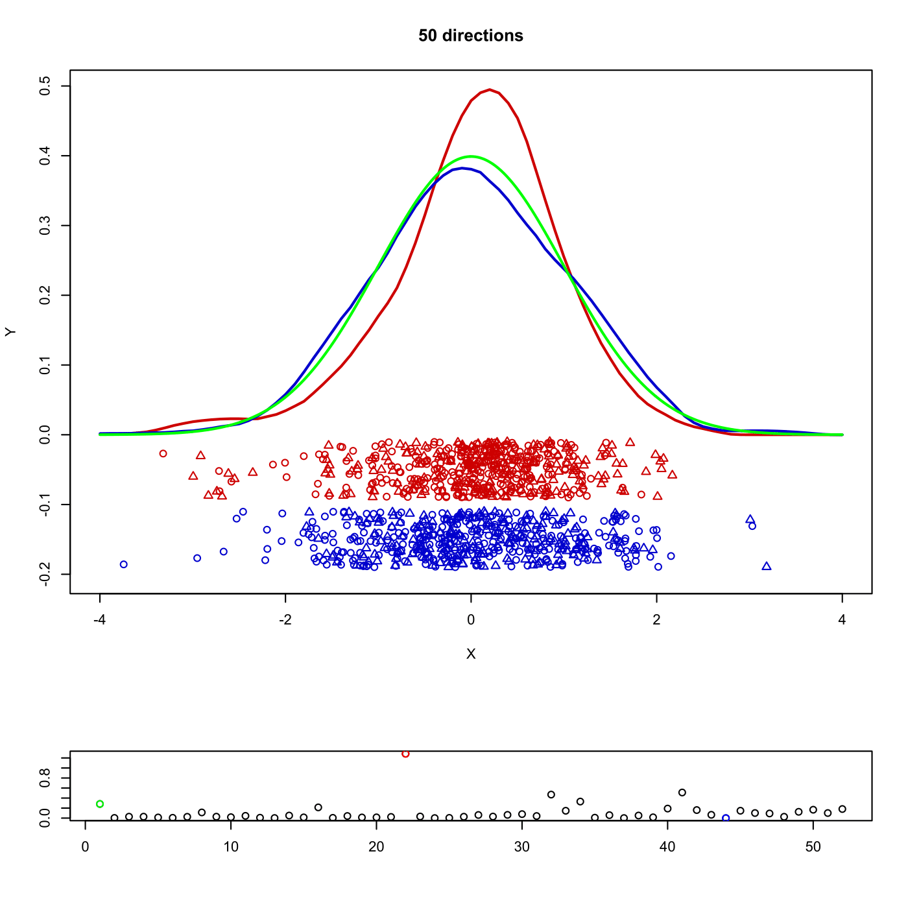
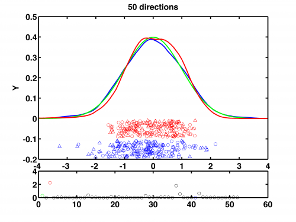
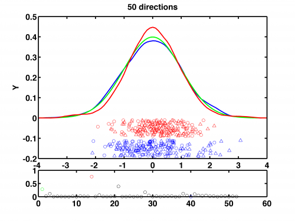

[](http://quantlet.de/)

## [](http://quantlet.de/) **MVAppsib** [](http://quantlet.de/)

```yaml

Name of QuantLet: MVAppsib

Published in: Applied Multivariate Statistical Analysis

Description: Reads the Boston housing data and spheres them to run Exploratory Projection Pursuit (EPP) on them. We select n (=50) randomly chosen one-dimensional projections in the space of the data. For each set of projected data the Sibson Jones index is applied, which considers the deviations from the normal density for univariate data, to judge the interestingness- of the projection.

Keywords: projection-pursuit, projection, EPP, exploratory-projection-pursuit, plot, graphical representation, Jones and Sibson index, estimation, density, data visualization, financial

See also: MVAsimdep1, MVAsirdata, MVAsir2data, MVAsimdepex, MVAppexample, ppsib, ppsibexample, ppexample, ppf

Author: Awdesch Melzer

Submitted: Wed, September 25 2013 by Awdesch Melzer

Datafile: bostonh.dat

Example: Projection Pursuit with the Sibson-Jones index for the original data set for 50 randomly chosen directions. The figure shows the density for the standard, normally distributed data (green) and the estimated densities for the best (red) and the worst (blue) projections found. A dotplot of the projections is also presented. In the lower part we see the values of the Sibson Jones index.

```







### MATLAB Code
```matlab

% ------------------------------------------------------------------------------
% Book:         MVA
% ------------------------------------------------------------------------------
% Quantlet:     MVAppsib
% ------------------------------------------------------------------------------
% Description:  MVAppsib reads the Boston housing data (bostonh.dat) and spheres them to run 
%               Exploratory Projection Pursuit (EPP) on them.
%               We select n (=50) randomly chosen one dimensional projections in 
%               the space of the data. For each set of projected
%               data the Sibson Jones index is applied, which considers the 
%               deviations from the normal density for univariate data, to judge the 
%               "interestingness" of the projection.
% ------------------------------------------------------------------------------
% Usage:        ppsib.m, ppsibexample.m, sphere.m
% ------------------------------------------------------------------------------
% Inputs:       None      
% ------------------------------------------------------------------------------
% Output:       In the graphics we see the density for the standard normal
%               distributed data (green) and the estimated densities for the
%               best (red) and the worst (blue) projections found. Additionally
%               we see a dotplot of the projections. In the lower part, we see 
%               the values of the Sibson Jones index.
% ------------------------------------------------------------------------------
% Example:      -
% ------------------------------------------------------------------------------
% Author:       Anastasiadou, Zografia
%               Awdesch Melzer 20130924
% ------------------------------------------------------------------------------

% clear variables and close windows
clear all;
close all;
clc;

RandStream.setGlobalStream(RandStream('mt19937ar','seed',100));

% load data
x = load('bostonh.dat');


% uncomment the next lines for transformed data
% xt       = x;
% xt(:,1)  = log(x(:,1));
% xt(:,2)  = x(:,2)./10;
% xt(:,3)  = log(x(:,3));
% xt(:,5)  = log(x(:,5));
% xt(:,6)  = log(x(:,6));
% xt(:,7)  = (x(:,7).^(2.5))./10000;
% xt(:,8)  = log(x(:,8));
% xt(:,9)  = log(x(:,9));
% xt(:,10) = log(x(:,10));
% xt(:,11) = exp(0.4*x(:,11))./1000;
% xt(:,12) = x(:,12)./100;
% xt(:,13) = sqrt(x(:,13));
% xt(:,14) = log(x(:,14));
% x = xt;

x(:,4) = [];

%

% sphere the data
x = sphere(x);

% choose bandwidth
h = 1.06*length(x)^(-1/5).*max(std(x));

% choose number of projections
n = 50;

[xa xi fa fi tit pind cind] = ppsibexample(x, h, n);

 
subplot(5,1,1:4);
    plot(fi(:,1),fi(:,2),'b-','LineWidth',2)
    hold on;
    plot(xa(1:100,1),xa(1:100,2),'ro')
    plot([-4:0.01:4]',normpdf([-4:0.01:4]',0,1),'g-','LineWidth',2)
    ylim([-0.2,0.5]);
    xlim([-4,4]);
    plot(xa(101:200,1),xa(101:200,2),'r^')
    plot(xi(1:100,1),xi(1:100,2),'bo')
    plot(xi(101:200,1),xi(101:200,2),'b^')
    ylabel('Y','FontWeight','bold','FontSize',16);
    xlabel('X','FontWeight','bold','FontSize',16);
    line(fa(:,1),fa(:,2),'color','r','LineWidth',2)
    box on
    set(gca,'FontSize',16,'LineWidth',2,'FontWeight','bold');
    hold off;
    title(tit,'FontWeight','bold','FontSize',16);
subplot(5,1,5);
    plot(pind(:,1),pind(:,2),'ko')
    hold on
    plot(pind(find(cind==1),1),pind(find(cind==1),2),'bo')
    plot(pind(find(cind==2),1),pind(find(cind==2),2),'go')
    plot(pind(find(cind==4),1),pind(find(cind==4),2),'ro')
    box on;
    set(gca,'FontSize',16,'LineWidth',2,'FontWeight','bold');
    hold off
    
  %   print -painters -dpdf -r600 MVAppsib_orig.pdf
  %   print -painters -dpng -r600 MVAppsib_orig.png

```

automatically created on 2021-07-10

### R Code
```r


# clear all variables
rm(list = ls(all = TRUE))
graphics.off()

# install and load packages
libraries = c("locpol")
lapply(libraries, function(x) if (!(x %in% installed.packages())) {
    install.packages(x)
})
lapply(libraries, library, quietly = TRUE, character.only = TRUE)

ppexample = function(x, h, n) {
    xg = seq(-4, by = 0.1, length = 81)
    id = rbind(matrix(3, 100, 1), matrix(4, 100, 1))
    
    # select a starting vector
    p = rnorm(ncol(x))
    p = p/sqrt(sum(p^2))
    
    # compute index for starting vector
    xp      = x %*% p
    imin    = ppsib(xp)
    imax    = imin
    
    xi      = cbind(xp, runif(length(xp), 0, 1))
    xi[, 2] = -0.11 - 0.08 * xi[, 2]
    fi      = PRDenEstC(xp, xeval = xg, bw = h, kernel = EpaK)
    xa      = cbind(xp, runif(length(xp), 0, 1))
    xa[, 2] = -0.01 - 0.08 * xa[, 2]
    fa      = PRDenEstC(xp, xeval = xg, bw = h, kernel = EpaK)
    
    # plot
    plot(xa, type = "n", ylab = "Y", xlab = "X", ylim = c(-0.2, max(fi[, 2], fa[, 
        2])), xlim = c(-4, 4))
    points(xa, col = "red3", pch = c(rep(1, 100), rep(2, 100)))
    points(xi, col = "blue3", pch = c(rep(1, 100), rep(2, 100)))
    lines(fa, col = "red3", lwd = 2, lty = 1)
    lines(fi, col = "blue3", lwd = 2)
    inds = c(1/sqrt(4 * pi), imax)
    pind = cbind((1:length(inds)), inds)
    
    # search for better projection vector
    i       = 0
    pmin    = 1
    pmax    = 1
    while (i < n) {
        i       = i + 1
        tit     = toString(paste(i, "directions"))
        p       = rnorm(ncol(x))
        p       = p/sqrt(sum(p^2))
        xp      = x %*% p
        ind     = ppsib(xp)
        inds    = c(inds, ind)
        pind    = cbind(1:length(inds), inds)
        
        if (ind > imax) {
            imax    = ind
            xa      = cbind(xp, runif(xp, 0, 1))
            xa[, 2] = -0.01 - 0.08 * xa[, 2]
            fa      = PRDenEstC(xp, xeval = xg, bw = h, kernel = EpaK)  # line red dashed
            
            # plot
            plot(xa, type = "n", ylab = "Y", xlab = "X", ylim = c(-0.2, max(fi[, 
                2], fa[, 2])), xlim = c(-4, 4))
            points(xa, col = "red3", pch = c(rep(1, 100), rep(2, 100)))
            points(xi, col = "blue3", pch = c(rep(1, 100), rep(2, 100)))
            lines(fa, col = "red3", lwd = 2, lty = 1)
            lines(fi, col = "blue3", lwd = 2)
            title(tit)
            pmin = i
        }
        if (ind < imin) {
            imin    = ind
            xi      = cbind(xp, runif(xp, 0, 1))
            xi[, 2] = -0.11 - 0.08 * xi[, 2]
            fi      = PRDenEstC(xp, xeval = xg, bw = h, kernel = EpaK)  # blue line
            
            # plot
            plot(xa, type = "n", ylab = "Y", xlab = "X", ylim = c(-0.2, max(fi[, 
                2], fa[, 2])), xlim = c(-4, 4))
            points(xa, col = "red3", pch = c(rep(1, 100), rep(2, 100)))
            points(xi, col = "blue3", pch = c(rep(1, 100), rep(2, 100)))
            lines(fa, col = "red3", lwd = 2, lty = 1)
            lines(fi, col = "blue3", lwd = 2)
            title(tit)
            pmax = i
            mini = p
        }
    }
    cind = pind[, 2]
    cind[pind[, 2] > which.min(pind[, 2]) | pind[, 2] < which.max(pind[, 2])] = 0
    cind[which.min(pind[, 2])] = 1
    cind[which.max(pind[, 2])] = 4
    cind[1] = 2
    
    return(list(xa = xa, xi = xi, fa = fa, fi = fi, tit = tit, pind = pind, cind = cind))
}

ppsib = function(px) {
    n   = NROW(px)
    m   = NCOL(px)
    cx  = px - matrix(colMeans(px), nrow = n, ncol = m, byrow = T)
    mu  = rbind(apply(cx, 2, mean), apply(cx^2, 2, mean), apply(cx^3, 2, mean), apply(cx^4, 
        2, mean))
    k3  = mu[3]
    k4  = mu[4] - (3 * (mu[2]^2))
    ind = ((k3^2) + ((k4^2)/4))/12
    return(ind)
}

# sphere data transform
sphere = function(x) {
    x = x - matrix(colMeans(x), nrow = NROW(x), ncol = NCOL(x), byrow = T)
    s = svd(var(x))
    s = s$u/matrix(sqrt(s$d), nrow(s$u), ncol(s$u), byrow = T)
    x = as.matrix(x) %*% as.matrix(s)
    return(x)
}

# load data
x = read.table("bostonh.dat")

# uncomment the next lines for transformed data
# xt = x; xt[,1] = log(x[,1]); xt[,2] = x[,2]/10; xt[,3] = log(x[,3]);
# xt[,5] = log(x[,5]); xt[,6] = log(x[,6]); xt[,7] = (x[,7]^(2.5))/10000;
# xt[,8] = log(x[,8]); xt[,9] = log(x[,9]); xt[,10] = log(x[,10]);
# xt[,11] = exp(0.4*x[,11])/1000; xt[,12] = x[,12]/100;
# xt[,13] = sqrt(x[,13]); xt[,14] = log(x[,14]); x = xt[,-4];

x       = x[, -4]                   # select variables
x       = sphere(as.matrix(x))      # sphere the data
set.seed(0)
h       = 2.62 * nrow(x)^(-1/5)     # choose bandwidth related to Scott's rule
n       = 50                        # choose number of projections
inde    = ppexample(as.matrix(x), h, n)

layout(c(1, 1, 1, 2))

# Plot
plot(inde$xa, type = "n", ylab = "Y", xlab = "X", ylim = c(-0.2, max(inde$fi[, 2], 
    inde$fa[, 2])), xlim = c(-4, 4))
points(inde$xa, col = "red3", pch = c(rep(1, 100), rep(2, 100)))
points(inde$xi, col = "blue3", pch = c(rep(1, 100), rep(2, 100)))
lines(inde$fa, col = "red3", lwd = 2, lty = 1)
lines(inde$fi, col = "blue3", lwd = 2)
title(inde$tit)
lines(seq(-4, 4, by = 0.01), dnorm(seq(-4, 4, by = 0.01), 0, 1), col = "green", lwd = 2)
plot(inde$pind, xlab = "", ylab = "")
points(inde$pind[which(inde$cind == 4), 1], inde$pind[which(inde$cind == 4), 2], 
    col = "red")
points(inde$pind[which(inde$cind == 1), 1], inde$pind[which(inde$cind == 1), 2], 
    col = "blue")
points(inde$pind[which(inde$cind == 2), 1], inde$pind[which(inde$cind == 2), 2], 
    col = "green") 

```

automatically created on 2021-07-10