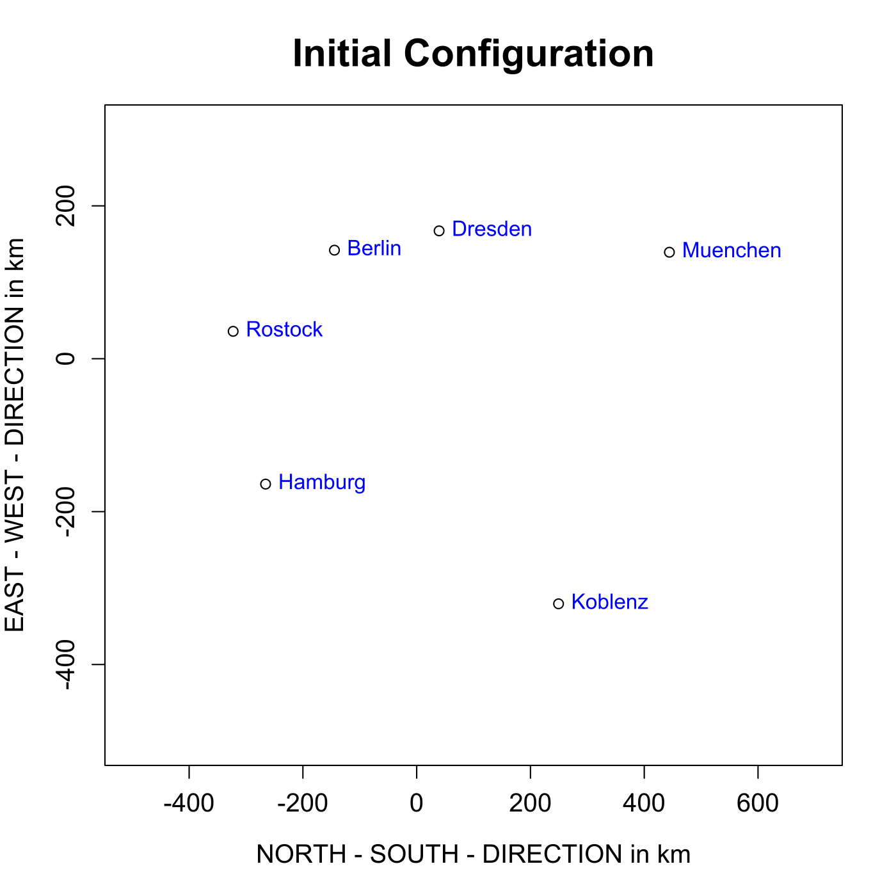
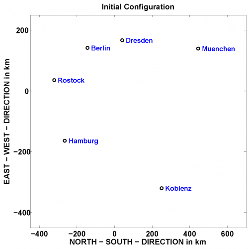
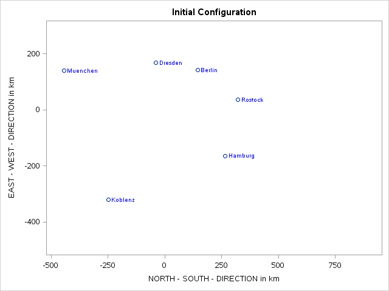

[](http://quantlet.de/)

## [](http://quantlet.de/) **MVAMDScity1** [](http://quantlet.de/)

```yaml

Name of QuantLet: MVAMDScity1

Published in: Applied Multivariate Statistical Analysis

Description: Computes the map of the cities by application of multidimensional scaling.

Keywords: MDS, multi-dimensional, scaling, plot, graphical representation, sas

See also: MVAMDScity2, MVAMDSnonmstart, MVAMDSpooladj, MVAmdscarm, MVAnmdscar1, MVAnmdscar2, MVAnmdscar3

Author: Zografia Anastasiadou
Author[SAS]: Svetlana Bykovskaya

Submitted: Tue, October 28 2014 by Felix Jung
Submitted[SAS]: Wen, March 30 2016 by Svetlana Bykovskaya

Example: Metric MDS solution for the intercity road distances.

```







### MATLAB Code
```matlab

% ---------------------------------------------------------------------
% Book:         MVA
% ---------------------------------------------------------------------
% Quantlet:     MVAMDScity1
% ---------------------------------------------------------------------
% Description:  MVAMDScity1 computes the map of the cities by application 
%               of multidimensional scaling. 
%               Corresponds to example 16.1 in MVA.
% ---------------------------------------------------------------------
% Usage:        -
% ---------------------------------------------------------------------
% Inputs:       None
% ---------------------------------------------------------------------
% Output:       Map of the cities as a metric MDS solution for the
%               inter-city road distances.
% ---------------------------------------------------------------------
% Example:      -
% ---------------------------------------------------------------------
% Author:       Wolfgang Haerdle, Vladimir Georgescu, Jorge Patron,
%               Song Song
% ---------------------------------------------------------------------

close all
clear
clc

%Intercity road distances
ber=[0 214 279 610 596 237];
dre=[214 0 492 533 496 444];
ham=[279 492 0 520 772 140];
kob=[610 533 520 0 521 687];
mue=[596 496 772 521 0 771];
ros=[237 444 140 687 771 0];

dist=[ber', dre', ham', kob', mue', ros'];

%aa,bb,hh,ii are matrices
aa=(dist.^2).*(-0.5);

ii=eye(6,6);
u=ones(1,6);

hh=ii-(1/6*(u'*u));

bb=hh*aa*hh; %Determine the inner product matrix

[v e]=eigs(bb);

x=v*(e.^0.5); %Determine the coordinate matrix

hold on
scatter(x(:,1),x(:,2),'k')
title('Initial Configuration')
xlabel('NORTH - SOUTH - DIRECTION in km')
ylabel('EAST - WEST - DIRECTION in km')
xlim([-500 700])
ylim([-500 300])
set(gca,'box','on')

text(x(1,1)+20,x(1,2),'Berlin','Color','b')
text(x(2,1)+20,x(2,2),'Dresden','Color','b')
text(x(3,1)+20,x(3,2),'Hamburg','Color','b')
text(x(4,1)+20,x(4,2),'Koblenz','Color','b')
text(x(5,1)+20,x(5,2),'Muenchen','Color','b')
text(x(6,1)+20,x(6,2),'Rostock','Color','b')

hold off

```

automatically created on 2021-07-10

### R Code
```r


# clear all variables
rm(list = ls(all = TRUE))
graphics.off()

# Intercity road distances
ber  = c(0, 214, 279, 610, 596, 237)
dre  = c(214, 0, 492, 533, 496, 444)
ham  = c(279, 492, 0, 520, 772, 140)
kob  = c(610, 533, 520, 0, 521, 687)
mue  = c(596, 496, 772, 521, 0, 771)
ros  = c(237, 444, 140, 687, 771, 0)

dist = cbind(ber, dre, ham, kob, mue, ros)

# a, b, h, i are matrices
a    = (dist^2) * (-0.5)
i    = diag(6)
u    = rep(1, 6)
h    = i - (1/6 * (u %*% t(u)))
b    = h %*% a %*% h                       # Determine the inner product matrix
e    = eigen(b)
x    = e$vectors %*% (diag(e$values)^0.5)  # Determine the coordinate matrix

# Plot: Initial Configuration
plot(x[, 1], x[, 2], xlim = c(-500, 700), ylim = c(-500, 300), xlab = "NORTH - SOUTH - DIRECTION in km", 
    ylab = "EAST - WEST - DIRECTION in km", main = "Initial Configuration", cex.axis = 1.2, 
    cex.lab = 1.2, cex.main = 1.8)
text(x[, 1], x[, 2], labels = c("Berlin", "Dresden", "Hamburg", "Koblenz", "Muenchen", 
    "Rostock"), pos = 4, col = "blue") 

```

automatically created on 2021-07-10

### SAS Code
```sas


proc iml;
  * matrix "multiplication" where missing values are propagated;
  start MVMult(A, B);
    C = j(nrow(A), ncol(B), .);
    rows = loc(countmiss(A, "ROW")=0);
    cols = loc(countmiss(B, "COL")=0);
    if ncol(rows)>0 & ncol(cols)>0 then
      C[rows, cols] = A[rows,] * B[,cols];
    return(C);
  finish;

  * Intercity road distances;
  ber  = {0, 214, 279, 610, 596, 237};
  dre  = {214, 0, 492, 533, 496, 444};
  ham  = {279, 492, 0, 520, 772, 140};
  kob  = {610, 533, 520, 0, 521, 687};
  mue  = {596, 496, 772, 521, 0, 771};
  ros  = {237, 444, 140, 687, 771, 0};
  
  dist = ber || dre || ham || kob || mue || ros;
  
  * a, b, h, i are matrices;
  a = (dist ## 2) * (-0.5);
  u = j(6,1,1);
  i = diag(u);
  h = i - (1/6 * (u * t(u)));
  b = h * a * h;   * Determine the inner product matrix;
  V = eigvec(b);
  L = diag(eigval(b)) ## 0.5;
  x = MVMult(V,L); * Determine the coordinate matrix;
  
  x1 = x[,1];
  x2 = x[,2];
  cities = {'Berlin', 'Dresden', 'Hamburg', 'Koblenz', 'Muenchen', 'Rostock'};
  
  create plot var {"x1" "x2" "cities"};
    append;
  close plot;
quit;

proc sgplot data = plot;
  title 'Initial Configuration';
  scatter x = x1 y = x2 / datalabel = cities
    datalabelattrs = (color = blue) datalabelpos = right;
  xaxis min = -500 max = 700 label = 'NORTH - SOUTH - DIRECTION in km';
  yaxis min = -500 max = 300 label = 'EAST - WEST - DIRECTION in km';
run;


```

automatically created on 2021-07-10