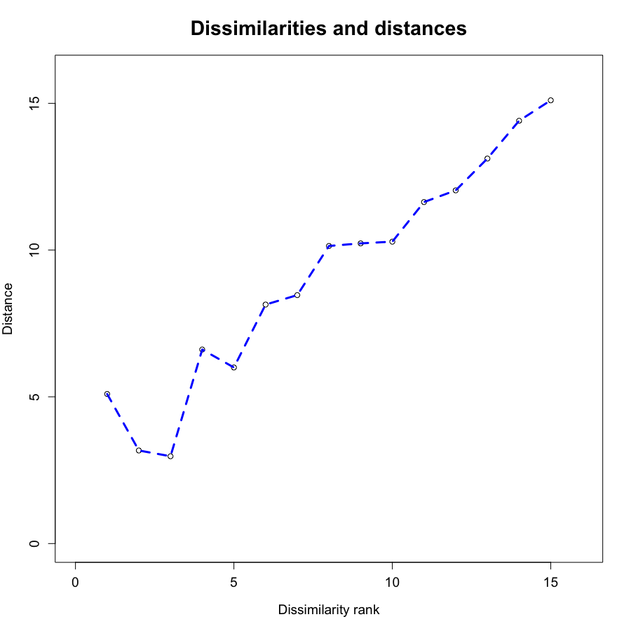
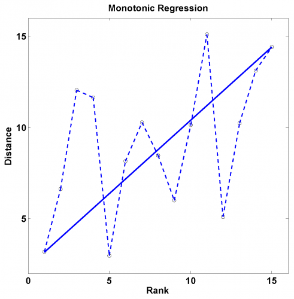
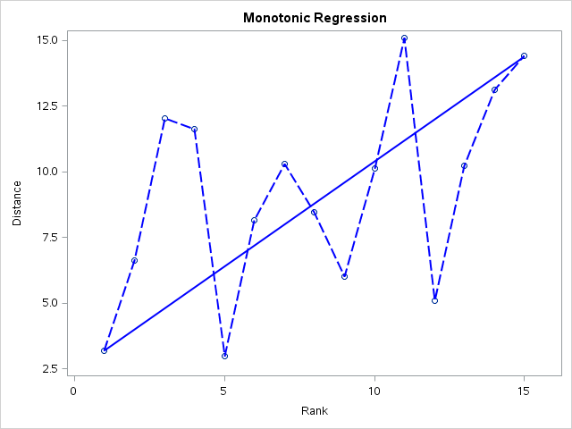

[](http://quantlet.de/)

## [](http://quantlet.de/) **MVAMDSnonmstart** [](http://quantlet.de/)

```yaml

Name of QuantLet: MVAMDSnonmstart

Published in: Applied Multivariate Statistical Analysis

Description: Computes the monotonic regression and shows the rank order of dissimilarities for the pool-adjacent violators (PAV) algorithm.

Keywords: MDS, non-metric-MDS, multi-dimensional, scaling, PAV, violators, Shepard-Kruskal, regression, plot, graphical representation, sas 

See also: MVAMDScity1, MVAMDScity2, MVAMDSpooladj, MVAmdscarm, MVAnmdscar1, MVAnmdscar2, MVAnmdscar3, MVAcarrankings, PAVAlgo

Author: Zografia Anastasiadou
Author[SAS]: Svetlana Bykovskaya

Submitted: Tue, October 28 2014 by Felix Jung
Submitted[SAS]: Tue, April 5 2016 by Svetlana Bykovskaya

Example: Ranks and distances.

```







### MATLAB Code
```matlab

% -------------------------------------------------------------------------
% Book:         MVA
% -------------------------------------------------------------------------
% Quantlet:     MVAMDSnonmstart
% -------------------------------------------------------------------------
% Description:  MVAMDSnonmstart computes the monotonic regression and shows
%               the rank order of dissimilarities for the pool-adjacent 
%               violators (PAV) algorithm.
% -------------------------------------------------------------------------
% Usage:        -
% -------------------------------------------------------------------------
% Inputs:       None
% -------------------------------------------------------------------------
% Output:       Plot of the monotonic regression and rank order of
%               dissimilarities.
% -------------------------------------------------------------------------
% Example:      -
% -------------------------------------------------------------------------
% Author:       Wolfgang Haerdle, Vladimir Georgescu, Jorge Patron, Song 
%               Song
% -------------------------------------------------------------------------

close all
clear
clc

ber=[0  2  4  12 11 3 ];
dre=[2  0  6  10 7  5 ];
ham=[4  6  0  8  15 1 ];
kob=[12 10 8  0  9  13];
mue=[11 7  15 9  0  14];
ros=[3  5  1  13 14 0 ];

dist=[ber', dre', ham', kob', mue', ros'];

%aa,bb,hh,ii are matrices

aa=(dist.^2).*(-0.5);

ii=eye(6,6);
u=ones(1,6);

hh=ii-(1/6*(u'*u));

bb=hh*aa*hh; %Determine the inner product matrix

[v e]=eigs(bb);

g1(:,1)=v(:,1);
g1(:,2)=v(:,2);

g2(1,1)=e(1,1);
g2(2,2)=e(2,2);
g2(1,2)=0;
g2(2,1)=0;

x=g1*(g2.^0.5); %Determine the coordinate matrix

%Determine the dissimilarities
d12=((x(1,1)-x(2,1))^2+(x(1,2)-x(2,2))^2)^0.5;
d13=((x(1,1)-x(3,1))^2+(x(1,2)-x(3,2))^2)^0.5;
d14=((x(1,1)-x(4,1))^2+(x(1,2)-x(4,2))^2)^0.5;
d15=((x(1,1)-x(5,1))^2+(x(1,2)-x(5,2))^2)^0.5;
d16=((x(1,1)-x(6,1))^2+(x(1,2)-x(6,2))^2)^0.5;

d23=((x(2,1)-x(3,1))^2+(x(2,2)-x(3,2))^2)^0.5;
d24=((x(2,1)-x(4,1))^2+(x(2,2)-x(4,2))^2)^0.5;
d25=((x(2,1)-x(5,1))^2+(x(2,2)-x(5,2))^2)^0.5;
d26=((x(2,1)-x(6,1))^2+(x(2,2)-x(6,2))^2)^0.5;

d34=((x(3,1)-x(4,1))^2+(x(3,2)-x(4,2))^2)^0.5;
d35=((x(3,1)-x(5,1))^2+(x(3,2)-x(5,2))^2)^0.5;
d36=((x(3,1)-x(6,1))^2+(x(3,2)-x(6,2))^2)^0.5;

d45=((x(4,1)-x(5,1))^2+(x(4,2)-x(5,2))^2)^0.5;
d46=((x(4,1)-x(6,1))^2+(x(4,2)-x(6,2))^2)^0.5;

d56=((x(5,1)-x(6,1))^2+(x(5,2)-x(6,2))^2)^0.5;


dd=[[0 d12 d13 d14 d15 d16];[d12 0 d23 d24 d25 d26];[d13 d23 0 d34 d35 d36];[d14 d24 d34 0 d45 d46];[d15 d25 d35 d45 0 d56];[d16 d26 d36 d46 d56 0]];

ff=[[1:15]',[d12;d13;d14;d15;d16;d23;d24;d25;d26;d34;d35;d36;d45;d46;d56]]; %Determine the rank order to dissimilarities

ll=[[15;1],[14.4;3.17]];

scatter(ff(:,1),ff(:,2),'k')
title('Monotonic Regression')
xlabel('Rank')
ylabel('Distance')
xlim([0 16])
set(gca,'box','on')

for i=1:14
    line([ff(i,1) ff(i+1,1)],[ff(i,2) ff(i+1,2)],'Color','b','LineWidth',1.5,'LineStyle','--')
end

line([ll(1,1) ll(2,1)],[ll(1,2) ll(2,2)],'Color','b','LineWidth',2)

```

automatically created on 2021-07-10

### R Code
```r


# clear all variables
rm(list = ls(all = TRUE))
graphics.off()

# Distance matrix with prior ordering of distances (delta_ij)
# for cities Berlin, Dresden, Hamburg, Koblemz, Muenchen, Rostock
ber = c(0, 2, 4, 12, 11, 3)
dre = c(2, 0, 6, 10, 7, 5)
ham = c(4, 6, 0, 8, 15, 1)
kob = c(12, 10, 8, 0, 9, 13)
mue = c(11, 7, 15, 9, 0, 14)
ros = c(3, 5, 1, 13, 14, 0)

dist = rbind(ber, dre, ham, kob, mue, ros)

# Determine x, the coordinate matrix of the cities
# a,b,h,i are matrices
a = (dist^2) * (-0.5)
i = diag(6)
u = rep(1, 6)
h = i - (1/6 * (u %*% t(u)))
b = h %*% a %*% h           # Determine the inner product matrix
e = eigen(b)

g1  = cbind(e$vectors[, 1], e$vectors[, 2])
g2  = diag(e$values[1:2])
x   = g1 %*% (g2^0.5)        # Determine the coordinate matrix

# Determine the distances between the cities from their coordinates (d_ij)
d12 = ((x[1, 1] - x[2, 1])^2 + (x[1, 2] - x[2, 2])^2)^0.5
d13 = ((x[1, 1] - x[3, 1])^2 + (x[1, 2] - x[3, 2])^2)^0.5
d14 = ((x[1, 1] - x[4, 1])^2 + (x[1, 2] - x[4, 2])^2)^0.5
d15 = ((x[1, 1] - x[5, 1])^2 + (x[1, 2] - x[5, 2])^2)^0.5
d16 = ((x[1, 1] - x[6, 1])^2 + (x[1, 2] - x[6, 2])^2)^0.5

d23 = ((x[2, 1] - x[3, 1])^2 + (x[2, 2] - x[3, 2])^2)^0.5
d24 = ((x[2, 1] - x[4, 1])^2 + (x[2, 2] - x[4, 2])^2)^0.5
d25 = ((x[2, 1] - x[5, 1])^2 + (x[2, 2] - x[5, 2])^2)^0.5
d26 = ((x[2, 1] - x[6, 1])^2 + (x[2, 2] - x[6, 2])^2)^0.5

d34 = ((x[3, 1] - x[4, 1])^2 + (x[3, 2] - x[4, 2])^2)^0.5
d35 = ((x[3, 1] - x[5, 1])^2 + (x[3, 2] - x[5, 2])^2)^0.5
d36 = ((x[3, 1] - x[6, 1])^2 + (x[3, 2] - x[6, 2])^2)^0.5

d45 = ((x[4, 1] - x[5, 1])^2 + (x[4, 2] - x[5, 2])^2)^0.5
d46 = ((x[4, 1] - x[6, 1])^2 + (x[4, 2] - x[6, 2])^2)^0.5

d56 = ((x[5, 1] - x[6, 1])^2 + (x[5, 2] - x[6, 2])^2)^0.5

# Create distance matrix
dd = rbind(c(0, d12, d13, d14, d15, d16), c(d12, 0, d23, d24, d25, d26), c(d13, 
    d23, 0, d34, d35, d36), c(d14, d24, d34, 0, d45, d46), c(d15, d25, d35, d45, 
    0, d56), c(d16, d26, d36, d46, d56, 0))

# Order the distance based on order in prior order in dist
f = cbind(c(1:15), c(d36, d12, d16, d13, d26, d23, d25, d34, d45, d24, d15, d14, d46, d56, d35))

# Plot
plot(f, xlim = c(0, 16), ylim = c(0,16), xlab = "Dissimilarity rank", ylab = "Distance", main = "Dissimilarities and distances", 
    cex.axis = 1.2, cex.lab = 1.2, cex.main = 1.8)
lines(f, lty = 2, lwd = 3, col = "blue")

```

automatically created on 2021-07-10

### SAS Code
```sas


proc iml;
  * matrix "multiplication" where missing values are propagated;
  start MVMult(A, B);
    C = j(nrow(A), ncol(B), .);
    rows = loc(countmiss(A, "ROW")=0);
    cols = loc(countmiss(B, "COL")=0);
    if ncol(rows)>0 & ncol(cols)>0 then
      C[rows, cols] = A[rows,] * B[,cols];
    return(C);
  finish;

  * Intercity road distances;
  ber  = {0, 2, 4, 12, 11, 3};
  dre  = {2, 0, 6, 10, 7, 5};
  ham  = {4, 6, 0, 8, 15, 1};
  kob  = {12, 10, 8, 0, 9, 13};
  mue  = {11, 7, 15, 9, 0, 14};
  ros  = {3, 5, 1, 13, 14, 0};
  
  dist = ber || dre || ham || kob || mue || ros;
	
  * a,b,h,i are matrices;
  a  = (dist ## 2) * (-0.5);
  u  = j(6,1,1);
  i  = diag(u);
  h  = i - (1/6 * (u * t(u)));
  b  = h * a * h;              * Determine the inner product matrix;
  V  = eigvec(b);
  g1 = V[,1] || V[,2];
  g2 = diag((eigval(b))[1:2,]);
  x  = MVMult(g1,(g2 ## 0.5)); * Determine the coordinate matrix;
	
  * Determine the dissimilarities;
  d12 = ((x[1, 1] - x[2, 1]) ## 2 + (x[1, 2] - x[2, 2]) ## 2) ## 0.5;
  d13 = ((x[1, 1] - x[3, 1]) ## 2 + (x[1, 2] - x[3, 2]) ## 2) ## 0.5;
  d14 = ((x[1, 1] - x[4, 1]) ## 2 + (x[1, 2] - x[4, 2]) ## 2) ## 0.5;
  d15 = ((x[1, 1] - x[5, 1]) ## 2 + (x[1, 2] - x[5, 2]) ## 2) ## 0.5;
  d16 = ((x[1, 1] - x[6, 1]) ## 2 + (x[1, 2] - x[6, 2]) ## 2) ## 0.5;

  d23 = ((x[2, 1] - x[3, 1]) ## 2 + (x[2, 2] - x[3, 2]) ## 2) ## 0.5;
  d24 = ((x[2, 1] - x[4, 1]) ## 2 + (x[2, 2] - x[4, 2]) ## 2) ## 0.5;
  d25 = ((x[2, 1] - x[5, 1]) ## 2 + (x[2, 2] - x[5, 2]) ## 2) ## 0.5;
  d26 = ((x[2, 1] - x[6, 1]) ## 2 + (x[2, 2] - x[6, 2]) ## 2) ## 0.5;

  d34 = ((x[3, 1] - x[4, 1]) ## 2 + (x[3, 2] - x[4, 2]) ## 2) ## 0.5;
  d35 = ((x[3, 1] - x[5, 1]) ## 2 + (x[3, 2] - x[5, 2]) ## 2) ## 0.5;
  d36 = ((x[3, 1] - x[6, 1]) ## 2 + (x[3, 2] - x[6, 2]) ## 2) ## 0.5;

  d45 = ((x[4, 1] - x[5, 1]) ## 2 + (x[4, 2] - x[5, 2]) ## 2) ## 0.5;
  d46 = ((x[4, 1] - x[6, 1]) ## 2 + (x[4, 2] - x[6, 2]) ## 2) ## 0.5;

  d56 = ((x[5, 1] - x[6, 1]) ## 2 + (x[5, 2] - x[6, 2]) ## 2) ## 0.5;
	
  dd  = (0   || d12 || d13 || d14 || d15 || d16) //
    (d12 || 0   || d23 || d24 || d25 || d26) //
    (d13 || d23 || 0   || d34 || d35 || d36) //
    (d14 || d24 || d34 || 0   || d45 || d46) //
    (d15 || d25 || d35 || d45 || 0   || d56) //
    (d16 || d26 || d36 || d46 || d56 || 0);
	
  * Determine the rank order to dissimilarities;
  f  = (1:15)` || (d12 || d13 || d14 || d15 || d16 || 
    d23 || d24 || d25 || d26 || d34 || d35 || d36 || d45 || d46 || d56)`;
	
  l  = {15, 1} || {14.4, 3.17};
    
  x1 = f[,1];
  x2 = f[,2];
  x3 = l[,1];
  x4 = l[,2];
	
  create plot var {"x1" "x2" "x3" "x4"};
    append;
  close plot;
quit;

proc sgplot data = plot
    noautolegend;
  title 'Monotonic Regression';
  scatter x = x1 y = x2;
  series  x = x1 y = x2 / lineattrs = (pattern = 4 color  = blue THICKNESS = 2);
  series  x = x3 y = x4 / lineattrs = (color = blue THICKNESS = 2);
  xaxis min = 0 max = 16 label = 'Rank';
  yaxis label = 'Distance'; 
run;


```

automatically created on 2021-07-10